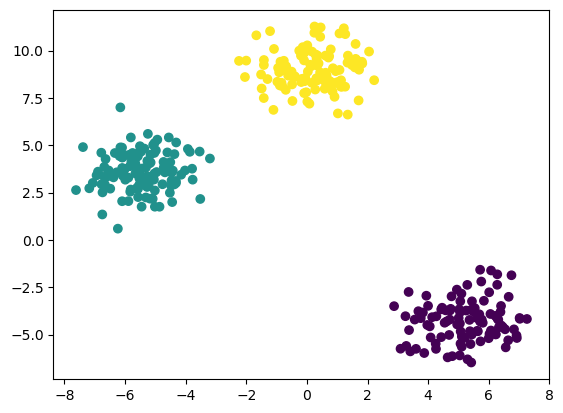
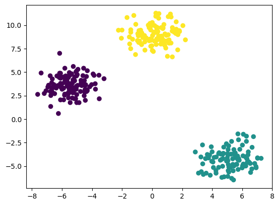
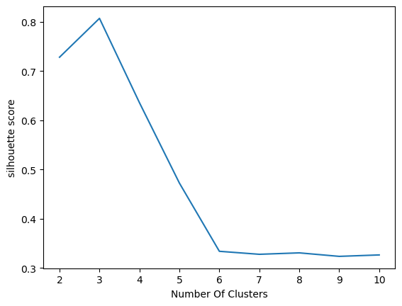

# 🔵 K-Means Clustering


An unsupervised machine learning project that applies **K-Means Clustering** using both the **Silhouette Score method** and the **Elbow Method** to determine the optimal number of clusters and visualize clustering results.

---

## 📌 Project Overview

This project explores **K-Means clustering** on a dataset using two popular techniques to select the optimal number of clusters (*k*):

- **Silhouette Score Method**
- **Elbow Method (WCSS)**

Both methods are implemented and their clustering outputs are visualized to compare cluster separation and compactness.

---

## 📁 Project Structure

- k_mean_silhouette.ipynb — K-Means clustering using Silhouette Score  
- k_mean_clustering.ipynb — K-Means clustering using Elbow Method  
- dataset.csv — Dataset used for clustering  
- silhouette_output.png — Clustering output using Silhouette method  
- elbow_output.png — Clustering output using Elbow method  
- silhouette_score_vs_k.png — Silhouette Score vs Number of Clusters  
- wcss_vs_k.png — WCSS vs Number of Clusters  
- README.md — Project documentation  

---

## ⚙️ Technologies Used

- Python  
- NumPy  
- Pandas  
- Matplotlib  
- scikit-learn  
- Jupyter Notebook  

---

## 🧠 Machine Learning Model

- Algorithm: K-Means Clustering  
- Learning Type: Unsupervised Learning  
- Distance Metric: Euclidean Distance  
- Evaluation Methods: Silhouette Score, WCSS  

---

## 📊 Silhouette Method Output

The Silhouette method evaluates how well each data point fits within its assigned cluster.  
A higher silhouette score indicates better-defined and well-separated clusters.

### Clustering Result (Silhouette Method)


---

## 📊 Elbow Method Output

The Elbow method uses **Within-Cluster Sum of Squares (WCSS)** to assess cluster compactness.  
The clustering output shows the data grouped based on the selected optimal *k*.

### Clustering Result (Elbow Method)


---

## 📈 Evaluation Curves

### Silhouette Score vs Number of Clusters


### WCSS vs Number of Clusters


---

## ▶️ How to Run

1. Clone the repository  
```text
git clone https://github.com/btboilerplate/kmean-Clustering.git  
```

2. Install required libraries  
```text
pip install numpy pandas matplotlib scikit-learn  
```

3. Open and run the notebooks  
- k_mean_silhouette.ipynb  
- k_mean_clustering.ipynb  

---

## 🧪 Key Observations

- Silhouette method highlights cluster separation quality  
- Elbow method focuses on cluster compactness  
- Both methods suggest a consistent and meaningful choice of *k*  
- Visual outputs confirm clear cluster formation  

---

## 🚀 Future Improvements

- Apply clustering on real-world, high-dimensional datasets  
- Compare with DBSCAN and Hierarchical Clustering  
- Use PCA for dimensionality reduction  
- Automate optimal cluster selection  

---
